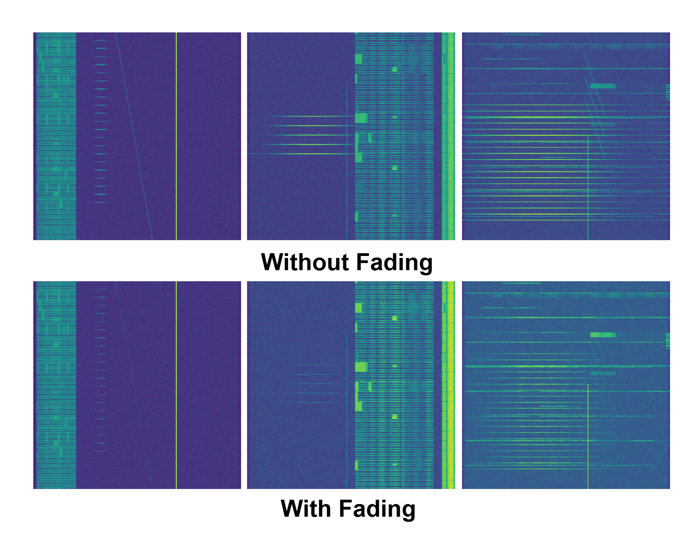
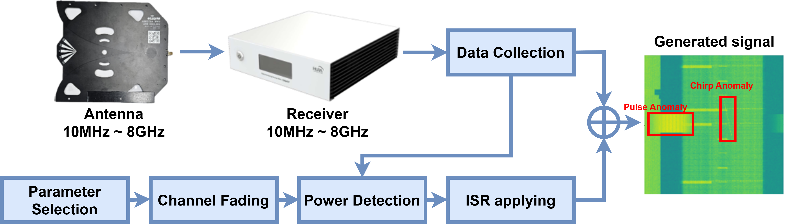

# WASD: Wireless Anomaly Signal Dataset

## Overview

WASD (Wireless Anomaly Signal Dataset) is designed for anomaly signal detection in wireless signals within fixed urban scenarios. It combines real-world signals measured across 19 LTE and 5G bands with simulated anomalous signals. This dataset is suitable for training various object detection networks and developing robust deep learning models for accurate and efficient anomaly detection in real-world environments.

## Paper Link
Under Review

## Dataset Features

* **Real-world Measurement Data**: Includes real-world signal data collected from 19 LTE and 5G bands.

* **Diverse Anomaly Signals**: Contains various types of simulated anomaly signals, including tone, chirp, and pulse signals.
* **Realistic Simulation**: Employs realistically feasible random-based parameters and configured fading channels in accordance with 3GPP standards to simulate real-world conditions.

* **Large-scale Dataset**: A comprehensive dataset comprising 85,500 samples across 19 bands.
* **Versatile Usage**: Includes both object detection and normal data, suitable for both supervised and unsupervised learning approaches.

## Dataset Structure

* **IQ Data**: Raw IQ data (`.bin` and `.json` files) measured for each band.
* **Spectrogram Data**: Spectrogram data (`.npy` files) generated using Short Time Fourier Transform (STFT).
* **Labels**: Label data (`.csv` files) containing bounding box coordinates and Interference-to-Signal Ratio (ISR) information of anomaly signals.
* **Data Loaders**: Example jupyter notebook (`.ipynb` files) for loading the IQ data, spectrogram datas into python workspaces.
* **Anomaly Signal Generation Examples**: Example jupyter notebook (`.ipynb` files) for generating abnormal wireless signal (tone, chirp, pulse) with the fading model. The detailed process and information can be found in the paper.

## Dataset Access
The download link will be available soon.
Since the data amount is large to deal with one file (784.24GB), the compressed file will be delivered as 50GB chunks.

|-- Dataset/   
|  |--IQ data.zip  
|  |  |-- Band name/  
|  |      |-- bin/  
|  |      |  |--IQ_date.bin  
|  |      |--IQ_date.json  
|  |    
|  |--npy data.zip   
|   |-- Abnormal/   
|     |-- Abnoraml_spectrogram.npy   
|   |-- Normal/   
|     |-- Normal_spectrogram.npy   
|   |-- Label/   
|     |-- Spectrum_label.csv   

* Dataset_split.z01
* Dataset_split.z02
* Dataset_split.z03
* Dataset_split.z04
* Dataset_split.z05
* Dataset_split.z06
* Dataset_split.z07
* Dataset_split.z08
* Dataset_split.z09
* Dataset_split.z10
* Dataset_split.z11
* Dataset_split.z12
* Dataset_split.z13
* Dataset_split.z14
* Dataset_split.z15
* Dataset_split

## Authors
Jinha Kim (jinha.kim@o.cnu.ac.kr), Hyeongwoo Kim (Hyeongwoo.kim@o.cnu.ac.kr), Byungkwan Kim(byungkwan.kim@cnu.ac.kr)

## Acknowledgements
This work was supported by the MSIT/IITP through the ICT R&D program (RS-2023-00229541).
